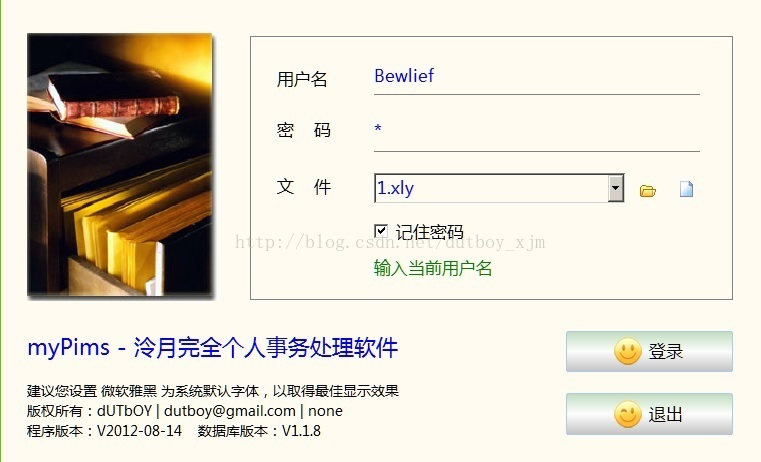
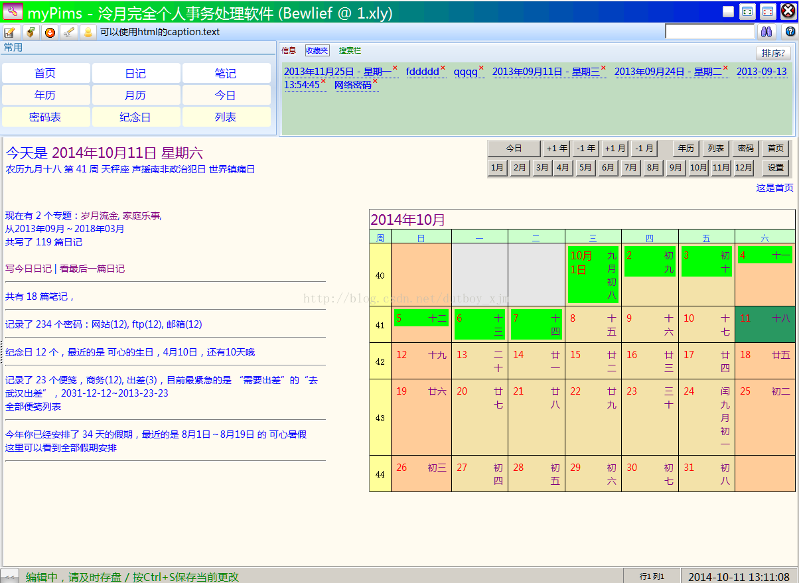
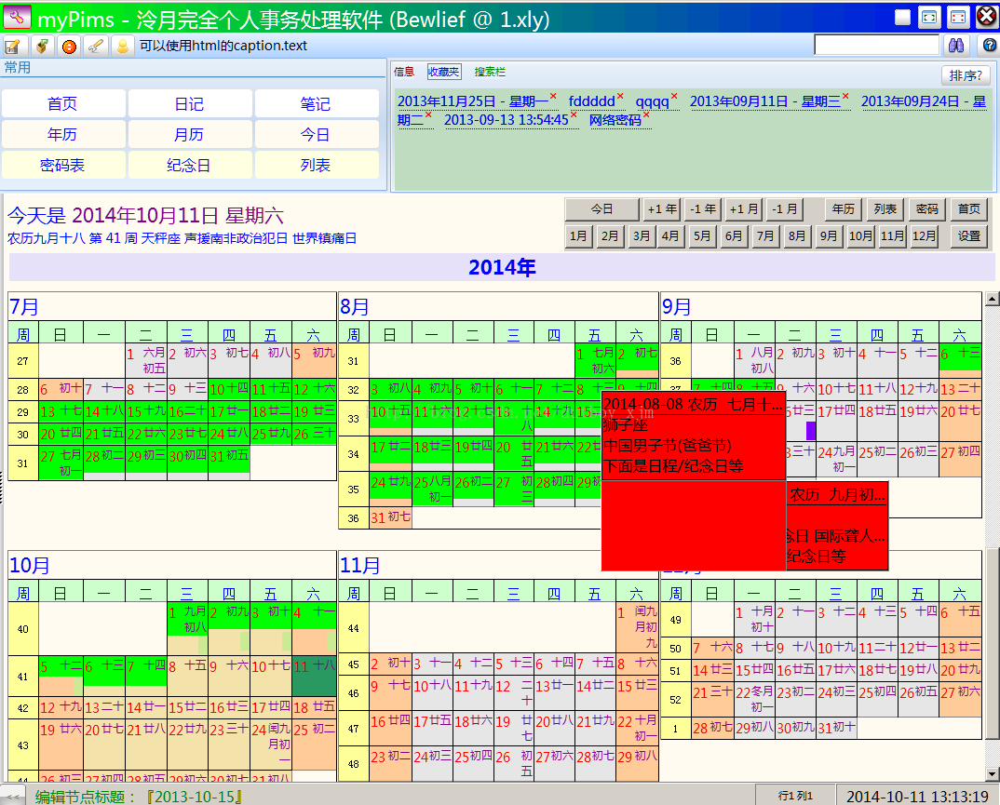
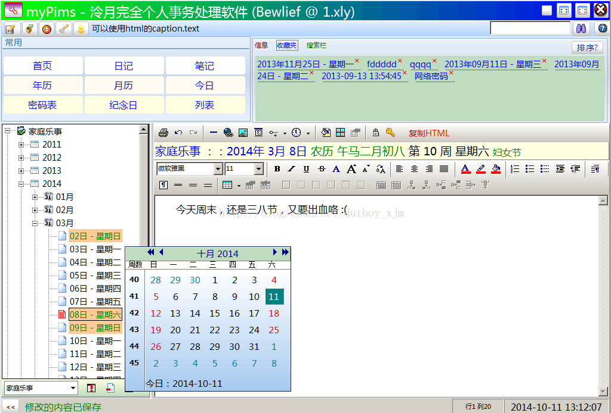
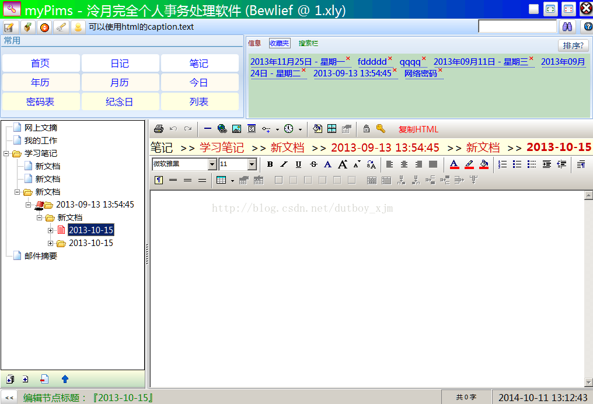
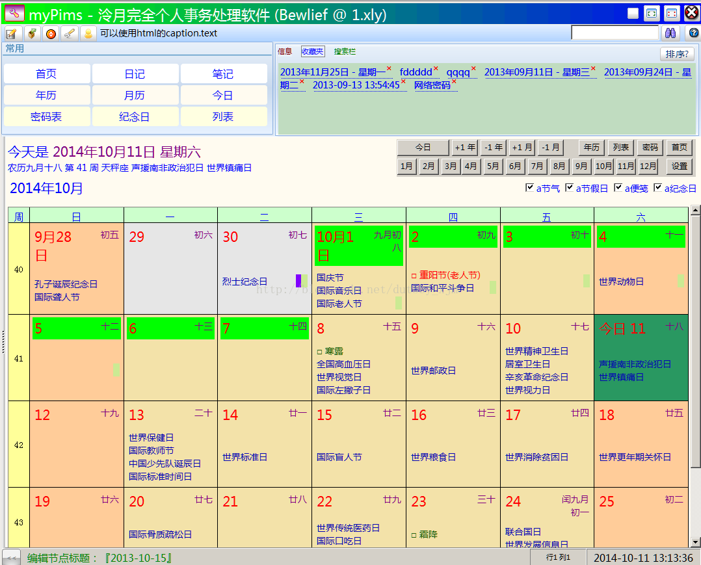
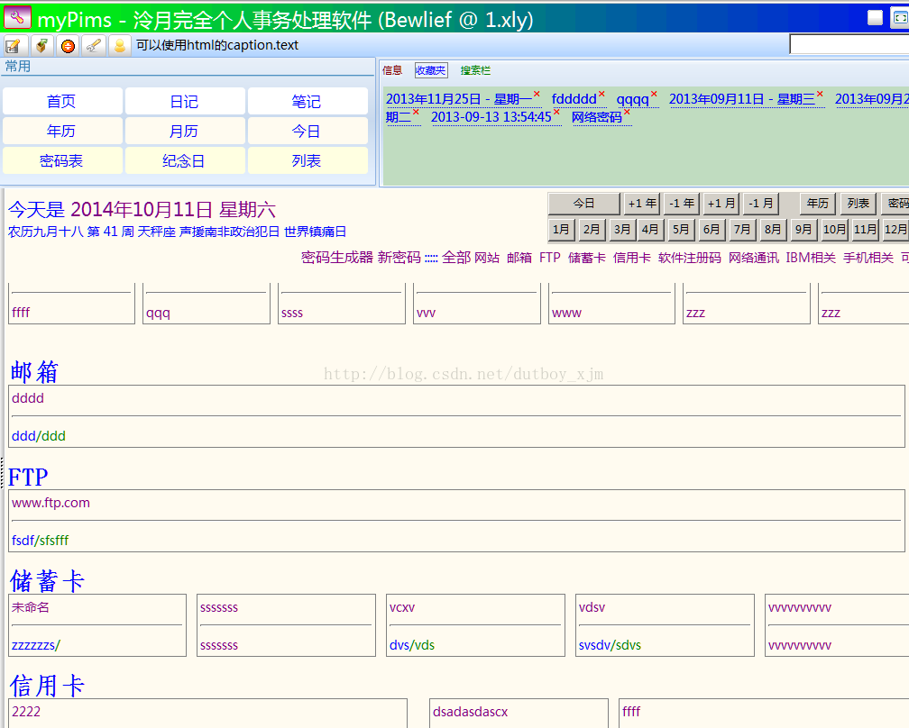
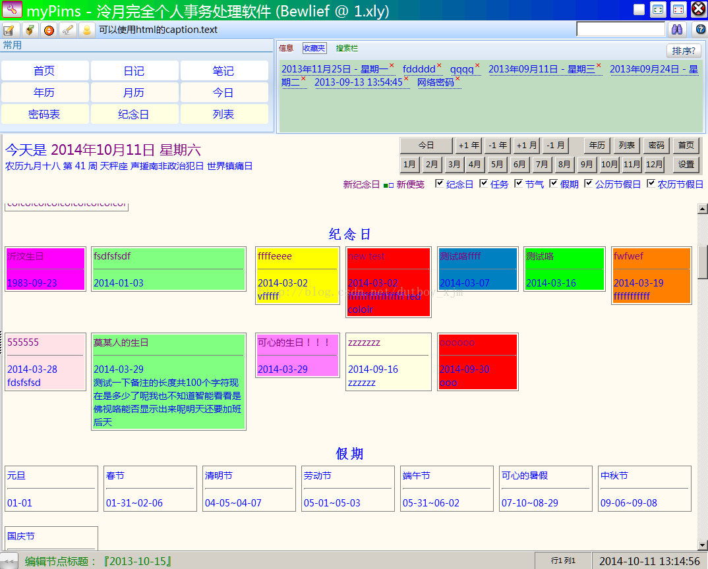
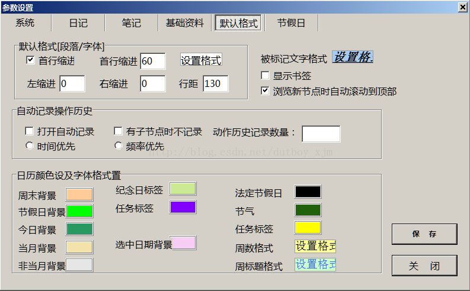
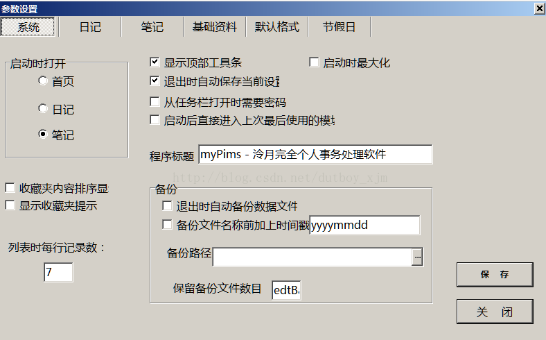

# myPims： my Personal Infomarion Management Software
## 简单说明
自己写的一个记事本程序，用于写日记，笔记，记录密码，查看日历，记录假期纪念日等，个人一直在使用着，已经写了从04年到现在几千篇日记了，还是蛮好用的。

放截图，宣传一下。

## 开发工具
使用dephi开发，最早是delphi6，到7，后来升级到xe2。

目前保留了一个win7的虚拟机专门用于mypims的维护。尝试了多次，由于使用了多个外部控件，一直没有在win10下搭建起开发环境，后来也懒得继续折腾，就保留了win7了。

数据库使用 absoluteDb，一个桌面版文件数据库。

## 截图

一直在完善中，哈。 从这里下载最新版：https://github.com/bewlief/MyRepo/blob/master/myPims/mypims.zip [2020/05/01 更新]

注：截图是以前的，和现在的版本稍有差别哦。

登录后的界面，左侧显示内容汇总，右侧显示当月的月历。上面为功能按钮及收藏夹，操作信息，搜索栏等。

日记的界面，左侧为日期树，按专辑，年，月，日排列。

笔记的界面，左侧为目录树，无限层次结构。

年历界面，一行3个月，分4行显示，绿色的表示是假期，其颜色，周末背景色等都可以自己定制。

月历，可显示纪念日，假期等。

密码记录界面，类别在设置里面可以管理，点击后可以修改。有个密码生成器，可以按需创建随机密码。

便笺栏，纪念日，假期等的列表显示。

纪念日的列表，背景色是在创建纪念日时自己选择的。

功能设置界面

## 开发语言
+ Delphi
+ AbsoluteDB

## 作者
bewlief
